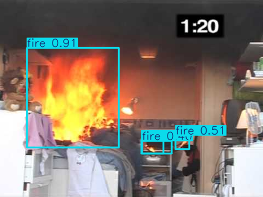
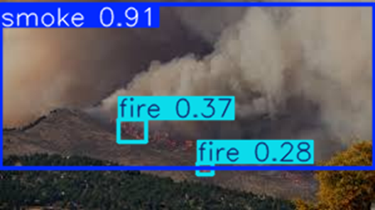

# 🔥 Fire & Smoke Detection using YOLOv11

A real-time fire and smoke detection system powered by the cutting-edge **YOLOv11** architecture. This project delivers high-speed, high-accuracy detection capabilities suited for industrial safety, smart buildings, and forest surveillance.

---

## 📖 Project Overview

This project implements a deep learning-based object detection system to classify and detect fire and smoke. The system is built using the latest **YOLOv11** model from Ultralytics and is trained on a dataset containing 21,527 labeled images from four categories:

- 🚬 **Smoke only**
- 🔥 **Fire only**
- 🌫️ **Smoke + Fire**
- 🌌 **Background (None)**

The model is optimized for real-time applications using GPU acceleration.

---

## 🧠 Model Architecture: YOLOv11

YOLOv11 offers major improvements over previous versions:

- 🔓 **Anchor-Free Detection** — More flexible and faster localization
- 🎯 **Distribution Focal Loss (DFL)** — Improves bounding box accuracy
- 🧱 **Efficient Backbone** — Uses C2f and SPPCSPC for deeper yet faster feature extraction
- 🧩 **Multi-Task Learning** — Supports object detection, segmentation, and classification
- ⚡ **High FPS** — Reaches 50+ FPS for real-time processing

---

## 🗂️ Dataset Summary

Dataset: [Kaggle – Smoke and Fire Detection YOLO Dataset](https://www.kaggle.com/datasets/sayedgamal99/smoke-fire-detection-yolo)

| Class               | Image Count |
|--------------------|-------------|
| Smoke only         | 5,867       |
| Fire only          | 1,164       |
| Smoke + Fire       | 4,658       |
| Background         | 9,838       |
| **Total**          | **21,527**  |

Augmentation techniques used: `flip`, `scale`, `color jitter`, `rotation`.

---

## 📊 Evaluation Metrics

| Metric       | Value     |
|--------------|-----------|
| **mAP@0.5**  | 0.606     |
| **F1 Score** | 0.61      |
| **Smoke Class Accuracy** | 64.3%     |
| **Fire Class Accuracy**  | 56.9%     |
| **Speed**    | 50 FPS    |

Model performance was visualized using confusion matrices, PR curves, and sample inference outputs.

---

## ⚙️ Requirements

- Python >= 3.10
- PyTorch
- Ultralytics (YOLOv11 branch)
- OpenCV
- Pandas
- Matplotlib

```bash
pip install -r requirements.txt
```

Or install manually:

```bash
pip install torch torchvision torchaudio
pip install ultralytics opencv-python matplotlib pandas
```

---

## 🔧 Setup & Execution

```bash
# Clone the repository
$ git clone https://github.com/yourusername/fire-smoke-detection.git
$ cd fire-smoke-detection

# Train the model
$ yolo train data=data.yaml model=yolov11.yaml imgsz=640 epochs=100 batch=16 device=0

# Validate on test set
$ yolo val model=best.pt data=data.yaml

# Run detection on custom image/video
$ yolo detect model=best.pt source=path/to/image_or_video
```

---

## 📷 Example Inference

<p align="center">
  
  
</p>

---

## 🚀 Future Work

- 🔄 Expand fire class samples for better generalization
- 🎥 Support live video stream detection
- 🌡️ Integrate thermal imaging for night-time or low-visibility scenes
- 📱 Export model to ONNX, TensorFlow.js, or TFLite for mobile/web
- 🧠 Deploy to edge devices (Jetson Nano, Raspberry Pi)

---

## 👨‍💻 Authors

**Abdulrahman Hamdi**  
Computer Engineering, Cumhuriyet University  
📧 abdulrahmanh524@gmail.com

**Supervisor:** Doç. Dr. Kemal Adem  
Department of Computer Engineering, Cumhuriyet University

---

## 📚 References

1. Redmon et al., "You Only Look Once: Unified, Real-Time Object Detection," CVPR 2016.  
2. Sayed Gamal, "Smoke and Fire Detection YOLO Dataset," Kaggle 2022.  
3. Bochkovskiy et al., "YOLOv4," arXiv:2004.10934.  
4. Ren et al., "Faster R-CNN," IEEE TPAMI, 2017.  
5. Ultralytics, YOLOv5 and YOLOv11 Documentation.  
6. OpenAI, ChatGPT Technical Reports.
